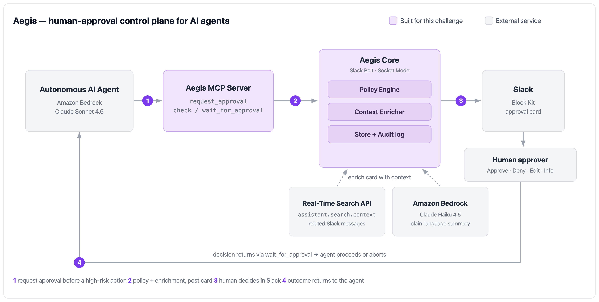

# 🛡️ Aegis — Human Approval for AI Agents

A **human-approval control plane for AI agents**. Before an agent performs a high-risk action — issuing a refund, dropping a production table, sending an external message — it asks a human for approval in **Slack**, and waits.

Built for the **Slack Agent Builder Challenge**.

📹 **Demo video:** https://youtu.be/c1jqPDPo6AU



## What it does

Any agent calls Aegis over **MCP** and pauses. Aegis posts a rich **Block Kit** approval card to Slack where a human can:

- ✅ **Approve** — the agent proceeds
- ❌ **Deny** — the agent safely aborts
- ✏️ **Edit & Approve** — change the agent's arguments first (e.g. lower a refund from $1,200 to $800); the agent then runs the *corrected* action and reports the change
- ❓ **Request Info**

Plus:

- **Policy engine** — auto-approve low-risk actions, require N-of-M approvals for critical ones, auto-expire stale requests (TTL).
- **Plain-language summaries** of each action via Amazon Bedrock.
- **Related Slack context** via the Real-Time Search API, attached to the card with permalinks.
- **Audit log** of every decision.

## How it works

The MCP server (`src/mcp-server.ts`) exposes three tools:

| Tool | Purpose |
|------|---------|
| `request_approval` | Post an approval card to Slack and return a request id (may auto-approve by policy) |
| `check_approval` | Get the current status (and any edited arguments) |
| `wait_for_approval` | Block until a human decides, or until timeout |

An agent calls `request_approval` before a risky action, then `wait_for_approval`. If approved with edited arguments, it uses the returned arguments. If denied or expired, it aborts.

## Tech stack

TypeScript · Slack Bolt (Socket Mode) · Model Context Protocol (MCP) · Amazon Bedrock (Claude Sonnet 4.6 + Claude Haiku 4.5) · Slack Real-Time Search API.

## Setup

```bash
npm install
cp .env.example .env   # then fill in your tokens
```

- Create a Slack app with **Socket Mode** enabled and the bot scopes needed for posting messages, interactivity, and (optionally) Assistant / Real-Time Search.
- Fill `SLACK_BOT_TOKEN`, `SLACK_APP_TOKEN`, and `AEGIS_DEFAULT_CHANNEL` in `.env`.
- AWS credentials for Amazon Bedrock are read from the default AWS credential chain (e.g. `~/.aws/credentials`); Bedrock runs in `us-east-1` by default.

## Run

Start the Slack app (handles approvals over Socket Mode):

```bash
npx tsx src/app.ts
```

Post a sample approval card:

```bash
npx tsx scripts/post-demo.ts <channel-id> refund-large   # refund-small | refund-large | refund-edit | drop-table
```

Run the end-to-end agent demo (a Bedrock agent that must get human approval over MCP):

```bash
npx tsx scripts/agent-demo.ts "Issue a refund of 1200 USD to ACME Corp for order ORD-4413."
```

## Project layout

```
src/
  app.ts          Slack Bolt app (Socket Mode) — renders cards, handles Approve/Deny/Edit
  mcp-server.ts   MCP server: request_approval / check_approval / wait_for_approval
  approvals.ts    Create request, run policy, post card, enrich with summary + context
  policy.ts       Policy engine (auto-approve / N-of-M / TTL)
  blocks.ts       Block Kit card + edit modal
  context.ts      Real-Time Search (assistant.search.context) + action_token cache
  summarize.ts    Plain-language summary via Amazon Bedrock
  store.ts        Persistence + audit log
scripts/
  post-demo.ts    Post a sample approval card
  agent-demo.ts   Bedrock agent <-> MCP <-> Slack end-to-end demo
```
